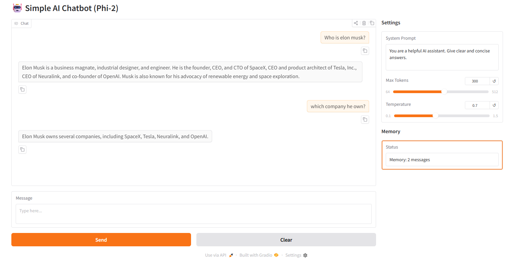

# 🤖 Simple AI Chatbot using Phi-2


A **lightweight, fully local AI chatbot** built with **Microsoft Phi-2** and **Gradio**, featuring **streaming responses** and a **minimal custom memory implementation** — no LangChain, no external APIs, no databases.

Designed to be **stable, hackable, and easy to understand**.

---

## 🖼️ App Demo Screenshot



---

## ✨ Features

* **Local LLM Inference:** Runs entirely on your machine (CPU or GPU).
* **Streaming Responses:** Token-by-token generation for a smooth chat experience.
* **Custom Memory (No LangChain):** Simple, trace-free conversation memory.
* **System Prompt Control:** Dynamically steer behavior from the UI.
* **GPU Acceleration:** Automatically uses CUDA when available.
* **Offline-Friendly:** No API keys, no network calls after model download.

---

## 🧠 Architecture Overview

```

User Input
↓
Prompt Builder

* System Prompt
* Conversation History (k-turn memory)
  ↓
  Phi-2 (Causal LM)
  ↓
  TextIteratorStreamer
  ↓
  Gradio Chat UI (Streaming)
  ↓
  Memory Update

````

This is a **classic causal-LM chat loop**, intentionally kept simple and transparent.

---

## 🛠️ Tech Stack

* **UI:** Gradio
* **LLM:** `microsoft/phi-2`
* **Framework:** Hugging Face Transformers
* **Backend:** PyTorch
* **Streaming:** `TextIteratorStreamer`
* **Memory:** Custom in-memory Python class

---

## 📦 Installation

### 1. Clone the Repository
```bash
git clone https://github.com/arman1o1/simple-phi2-chatbot.git
cd simple-phi2-chatbot
````

### 2. Install Dependencies

Use a virtual environment if possible.

```bash
pip install -r requirements.txt
```

**Minimum requirements:**

* Python 3.8+
* PyTorch
* transformers
* gradio

---

## ▶️ Usage

Run the app locally:

```bash
python app.py
```

On first run, **Phi-2 will download automatically**.

Once ready, Gradio will show:

```text
Running on local URL: http://127.0.0.1:7860
```

Open the link in your browser to start chatting.

---

## ⚙️ Key Design Choices

### 🔹 Custom Memory (Why Not LangChain?)

Instead of LangChain memory abstractions, this app uses a **simple rolling buffer**:

* Stores last `k` user/assistant turns
* Deterministic behavior
* Zero hidden state
* Easy to debug and extend

Perfect for:

* Experiments
* Research prototypes
* Local assistants

---

### 🔹 Prompt Format

```text
Instruct: <system prompt>
User: ...
Assistant: ...
User: ...
Assistant:
```

This aligns well with Phi-2’s instruction-tuned behavior.

---

### 🔹 Streaming Generation

* Uses a background thread + `TextIteratorStreamer`
* UI updates token-by-token
* Early stopping on prompt leakage (`User:`, `Instruct:`)

---

## 🧪 Limitations

* **Context Window:** Limited by Phi-2’s max context
* **Memory:** Simple sliding window (no summarization yet)
* **Safety:** No moderation layer
* **Scale:** Single-user, local-only

---

## 🧩 Extension Ideas

* Add conversation summarization
* Plug in a vector store for RAG
* Swap Phi-2 with Mistral / Gemma
* Persist memory to disk
* Add role-based system prompts

---

## 📄 License

This repository is licensed under the **MIT License**.

Model license:

* [`microsoft/phi-2`](https://huggingface.co/microsoft/phi-2) – MIT License

---
